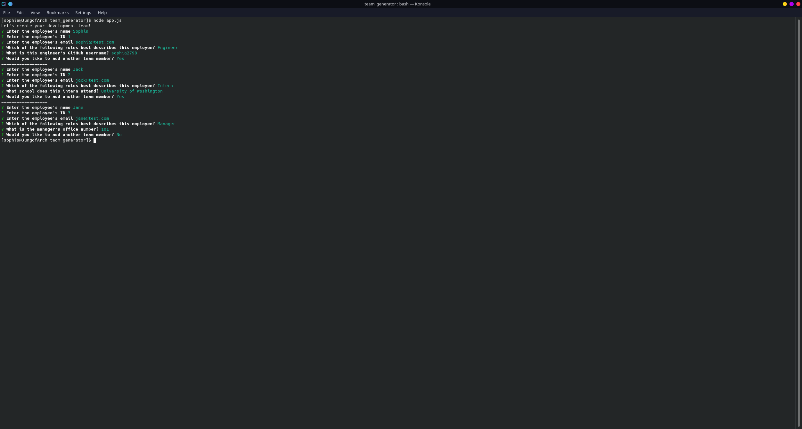
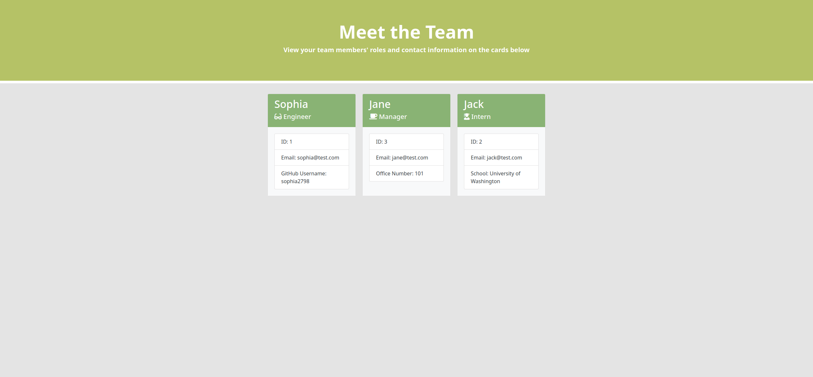

# CLI Team Generator
 

## Description
This project allows a user to create a team page from the command line that displays cards for each member. Each card contains the member's name, role, ID, email, and either their office number, school, or GitHub username depending on the member's role. The available roles to choose from are Manager, Engineer, and Intern. The program is written so that the user may add as many members as desired and until they choose to not add anymore. At that point, the command line prompts will cease and a team.html file will be created that contains the cards. 

This repository also contains test.js files that are run using npm jest to test the individual JavaScript files for each employee class. 

### Command Line Prompts

### Resultant HTML Page

## Table Of Contents
- [Access and Installation](#Access-and-Installation)
- [Usage](#Usage)
- [Features](#Features)
- [License](#License)
- [Contribution Guidelines](#Contribution-Guidelines)
- [Test Instructions](#Test-Instructions)
- [Questions](#Questions)

## Access and Installation

No external software or servers are necessary to install this project except for a text editor and a working browser. You can git clone this repository to your local computer and open the code files using a text editor. Once the correct npm packages are installed, the program can be run from the command line as long as you are in the same directory as the code files. The repository includes the package.json file needed to install the correct npm pacakges/dependencies. 

This project can be accessed either via the GitHub Repository.

- [GitHub Repository](https://github.com/sophia2798/team_generator)

To open and edit code files, you will need a text editor. The one used to create this page was Visual Studio Code (https://code.visualstudio.com/).

To install this repository, you can git clone the repository using the green "Code" button. You can copy and paste either the HTML or SSH URL.

## Usage
This project can be used to create a simple and easy to read page that displays all team members and contact information. This can be useful so that all members can familiarize themselves with their team and have the necessary information should they need to reach out/find any individual member. Using inquirer prompts and a command line interface create a streamlined and easy to follow way to input the data.

## Features
This project includes...

- A set of command line prompts using npm inquirer that allow for the user to input the necessary informatoin about each team member. Each prompt addresses edge cases to ensure valid responses. All prompts are input prompts except for the prompt which asks for the member's role, which is a list.

- A set of JavaScript test files to test the classes in the JavaScript files pertaining to each employee role

- A set of HTML templates to streamline the code when using npm fs to write/read/append files.

- A resultant HTML page that showcases cards for each member. The information on each card is taken from the user responses to the command line prompts.

## License
MIT
A short and simple permissive license with conditions only requiring preservation of copyright and license notices. Licensed works, modifications, and larger works may be distributed under different terms and without source code.

## Contribution Guidelines
Currently, this repository is not set up for contributions. A development branch, to which all merges can be made while protecting the master branch, must be made first. Therefore, please contact the owner(s) of this repository to start and manage such a branch.

Please ensure that PRIOR to any new contributions, you discuss your desired/planned changes via email with the owner(s) of the repository. Contact information can be found in the [Questions](#Questions) section. Changes should be reflected in an updated README as well. To ensure a high quality of code and minimal conflicts, pull requests can only be merged after being approved by another developer. 

To ensure a welcoming working environment, any contributor to this project must help maintain a harassment-free and safe environment. This includes:
    - Using inclusive language
    - Being respectful of various backgrounds and opinions
    - Accepting constructive criticism without aggression or anger
    - Being aware of what benefits the whole community
    - Showing kindness and empathy to one another

## Test Instructions
As the package.json file exists in this repository, only the following line is needed to install the necessary pacakges
    npm install

To run the program, input the following code into the command line
    node app.js

## Questions
If you have any questions, please feel free to reach out via email at sdf. Any further information can be found on my [GitHub Profile](https://github.com/wet) or my [LinkedIn Profile](https://linkedin.com/in/we).